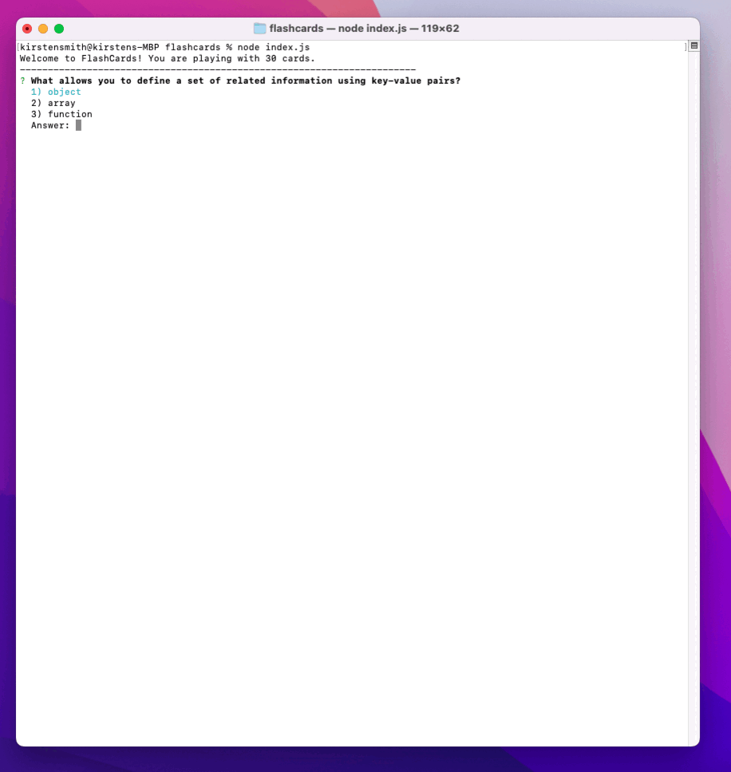

**Abstract:**

Test your knowledge of complex datatypes, iterators, and prototypes in this rousing game of flashcards!
The user is given 30 multiple choice or T/F questions to answer about Mod 2 core concepts. The questions are presented one at a time and the 
user answer is evaluated immediately. At the end of the game, the user is presented with their score as a percentage and the game exits. To play again, the user must re-run the game.

**Preview of App:**


**Installation Instructions:**

Clone down the repo onto a local device.
Once you have cloned the repo, change into the directory and run:
`node index.js` from the root to begin the game in the terminal.

**Context:**
This is the first project of Mod 2 and was completed in 3 days during the first week.

**Contributors:**
Kirsten Smith:
[GitHub](https://github.com/smithkirsten) 
[LinkedIn](https://www.linkedin.com/in/kirsten-stamm-smith/)

**Learning Goals:**
+ Contribute code to an partially constructed object-oriented application
+ Follow spec/prompts to make a working application
+ Implement ES6 classes
+ Write modular, reusable code that follows SRP (Single Responsibility Principle)
+ Implement a robust testing suite using TDD

**Wins & Challenges:**
I really enjoyed writing my own tests and experiencing how it helped me organize my code! It was challenging to only be able to test my work though my tests until the last phase of the project and to see the gaps that we can leave in tests, as developers (just because something passes a unit test, doesn't mean it works the way we think it will in the program!). The trickiest part for me was determining the order to call methods and instantiate objects in the ```takeTurn()``` method. I spent a while tracing when to change the current card such that it would both instantiate the turn correctly and evaluate correctly.

